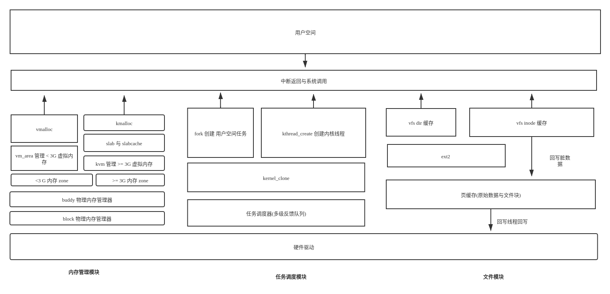

# quarkOS

一个玩具操作系统

[参考资料](./doc)

## 构建
1.  [构建 i686-elf-gcc](https://wiki.osdev.org/GCC_Cross-Compiler)
2. `./build.sh`

## 运行

`./run.sh`

## 调试

1. `./debug.sh`
2. 启动 gdb

## 设计

## TIPS:

- spin_lock 这类基于原子交换的结构(锁)在单核下的实现为关闭中断
- 启动会运行测试代码,打印测试信息,需要在 src/include/types.h 中去除 TEST 宏,重新构建

## TODO:

- 内存回收,(部分模块实现的内存回收函数,但底层 buddy 并没有调用)

- 更完善的用户空间( 它需要一个shell 😝 ) 

- 统一的错误码

- 部分代码不是线程安全的(这部分的数据结构可能修改,暂时不加锁)
 
- 网络协议栈

- SMP
