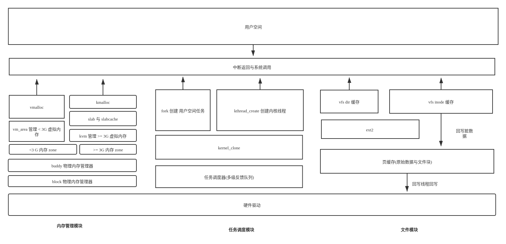

# quarkOS

一个玩具操作系统


[参考资料](./doc)

## 构建
1.  [构建 i686-elf-gcc](https://wiki.osdev.org/GCC_Cross-Compiler)
2. `./build.sh`

我使用的 gcc 版本:
```text
i686-elf-gcc (GCC) 10.2.0
Copyright (C) 2020 Free Software Foundation, Inc.
This is free software; see the source for copying conditions.  There is NO
warranty; not even for MERCHANTABILITY or FITNESS FOR A PARTICULAR PURPOSE.
```


## 运行

`./run.sh`

由于没有实现安装器，第一次运行时会将生成的 disk.img 挂载到 /tmp/disk，
并将用户空间代码复制到 disk.img 的 /bin 目录， 因此需要 root 权限 (见 generate-disk.sh)。


## 调试

建议使用 Clion，可以直接导入我的 .run 下配置，或者直接使用 gdb：

1. 允许读取 local .gdbint：
```bash
echo "set auto-load local-gdbinit on"  >> ~/.gdbinit
echo "add-auto-load-safe-path xxx/.gdbinit"  >> ~/.gdbinit
# 将 xxx 替换为你的 quarkOS 项目路径
```

2. `./debug.sh`
3. 启动 gdb，连接 1234 端口。
4. 添加用户空间代码时，需要将生成的文件添加到 .gdbinit 用于调试。
5. 

## 设计



- 内存管理模块： 底层实现  buddy/slab 分配器，基于 slab 实现了 slabcache。用户空间实现 vmalloc 虚拟内存分配器，内核空间实现 kvm 虚拟内存分配器
- 进程调度模块： 调度器基于多级反馈队列 调度实现。实现了轻量型进程与内核线程，仿照 Linux 实现了 kernel_clone,  封装 kernel_clone 为 kthread_create 来创建内核线程， 封装 kernel_clone 为 fork 创建用户进程，利用写时复制技术优化进程创建。
- 文件模块： 底层实现了页缓存，用于缓存原始数据块与文件数据块，上层实现 ext2 文件系统。顶层使用 vfs 封装，统一接口，并且实现 vfs 层缓存， 实现了 LRU 缓存算法与定时缓存回写(页缓存)。
- 系统调用： 利用传统中断调用与返回实现系统调用，而非 syscall 指令
- 锁机制： 利用 xchg 指令实现了自旋锁，睡眠锁（互斥锁），单核模式自旋锁为关闭中断。
- 用户空间： 使用 exec 系统调用创建了一个字符串读取任务
- 硬件驱动：参考硬件手册实现了 cmos，ide，dma，pci，pic 等驱动


## TIPS:

- 启动会运行测试代码，打印测试信息，需要在 src/include/types.h 中去除 TEST 宏，重新构建。

## TODO:

- 内存回收，(部分模块实现了内存回收函数，但底层 buddy 并没有调用)

- 它需要一个更完善的 shell 😝

- 统一的错误码

- 部分代码不是线程安全的(这部分的数据结构可能修改，暂时不加锁)

- 网络协议栈

- IPC

