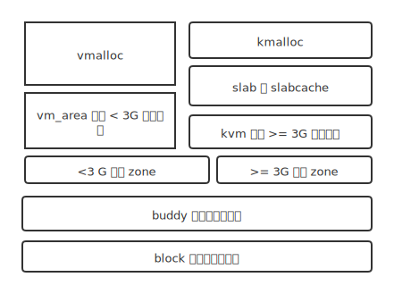
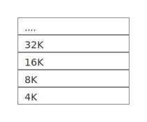
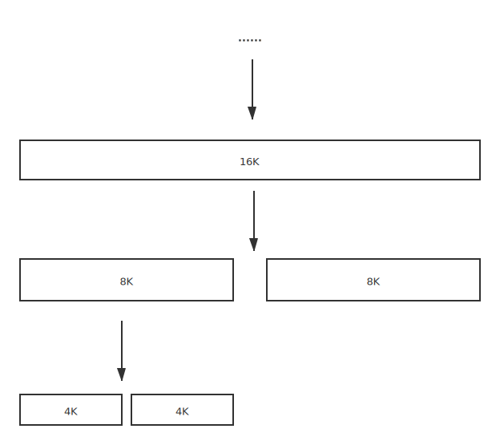
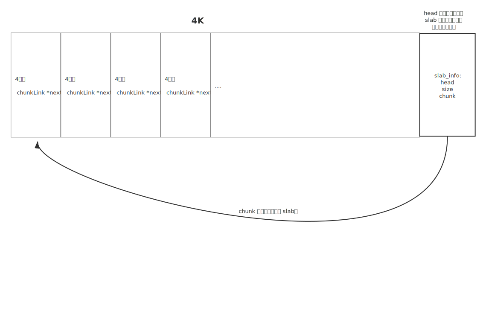
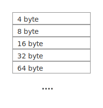

物理内存管理是内核不可缺少的一部分，提到内存管理，读者可能已经想到了大名鼎鼎的 buddy 内存管理算法，linux 使用 buddy/slab 管理物理内存，笔者参考 linux 的物理内存管理模型，实现了下面的内存管理模型：



最底层为 block 物理内存管理器，用于 buddy 内存管理器初始化之前的内存分配，block 管理器只有简单的 `block_alloc` 内存分配函数，在使用 block 管理器分配少量内存，并初始化 buddy 分配器后，buddy 接管物理内存，block 管理器弃用。笔者将物理内存分为大于 3G 与 小于 3G 两部分内存，大于 3G 内存用于内核，而小于 3G 的部分内存用于用户空间，如果内存不足 3G，则内核使用小于 3G 的内存。为什么将物理内存划分为两部分？这由内核虚拟内存管理器(kvm)的设计决定。kvm 将物理内存直接映射到虚拟内存，也就是内核部分物理地址即为虚拟地址，划出大于 3G 部分，以便内核直接映射。实际上 linux 曾经的均匀访存模型(uma)还有 dma 部分，笔者没有 dma 的需求（事实上我写了 dma 驱动，但是有个 BUG 死活找不出来，索性放弃了用 dma 的想法 😂 ）。

buddy 模块上层是内核的虚拟内存管理器 -- kvm，以及用户空间的虚拟内存管理器 vmalloc。由于 buddy 只能分配以页为单位的物理内存，会造成大量的内存浪费，并且伴随大量内部碎片，因此基于 buddy 实现了 slab 物理内存管理器。最终由 kmalloc 决定调用 buddy 还是 slab 分配物理内存，kmalloc 的实现原理相当简单，如果需要分配的内存大于页大小，则调用 buddy，否则调用 slab：

```c

    void *kmalloc(u32_t size) {
    size = fixSize(size);
    if (size <= SLAB_MAX)
        return slab_alloc(size);
    struct page *page = __alloc_page(size);
    kvm_map(page, VM_PRES | VM_KRW);
    return page->data;
}
```


用户空间虚拟内存由 vm_struct 结构管理，其中的 brk 管理用户堆，stack 管理用户栈，由 vmalloc 分配器映射虚拟内存。

下面是分配器的具体实现


## buddy 物理内存管理器

buddy 算法原理相当简单，以页为基本内存块，将内存以 2 的幂划分为多个内存块，比如依次为 4K（一页， 2 的 0 次方），8K（两页， 2 的 1 次方），16K，32K....4M，请求 4K 内存时，先判断是否有 4K 大小的空闲内存，如果有则直接分配，没有继而判断是否由 8K 大小的内存块，有则将 8K 拆分为两个 4K 内存块，分配 4K ，没有则继续判断 32K...可以简单地使用链表管理不同大小的内存块，4K，8K，16K ... 表头分别连接相应大小的空闲内存块。而释放过程与分配过程类似，比如释放 4K 内存，判断需要释放的内存块的 buddy 是否空闲，即是否在 4K 链表中，如果不存在，则直接将 4K 内存块插入 4K 表头，如果存在，删除 4K 表中的 buddy 块，将两个内存块合并为 8K，继续查找 8K 表头中，需要释放的 8K 内存块的 buddy 是否存在......


表头：




buddy 分配：



使用链表实现的 buddy 算法查找的时间复杂度为 O(n)，可以使用二叉搜索树优化，这是笔者以前的 buddy 算法的部分实现：

```c
//https://github.com/joshuap233/quarkOS/blob/eb3ca53f4b17c9d8f493cc6107d0fd036b099b74/src/mm/page_alloc.c


/*
 * 物理内存分配器
 * root:        root[11] 管理已分配块,root[0]-root[10] 对应 4K - 4M 内存块
 * allocated:   以分配内存块
 * addr:        物理内存分配器管理的内存起始地址
 * blockSize:   最小内存单元大小
 * listCnt:     list 链表剩余节点数量
 * list:        list 空闲节点链表
 */
struct allocator {
#define MAX_ORDER 10
    node_t *root[MAX_ORDER + 1];
    node_t *allocated;
    node_t *list;
    u16_t listCnt;
    u16_t blockSize;
    uint32_t addr;
} pmm;


// buddy 内存块
typedef struct treeNode {
#define SIZE(sizeLog) (1<<(sizeLog)) // 获取实际内存单元个数
    u32_t sizeLog: 8;                // 内存单元(4K)个数取log2
    u32_t pn: 24;					 
    struct treeNode *left;
    struct treeNode *right;
} node_t; 

// 获取 buddy 的页号
uint32_t get_buddy_pn(uint32_t pn, uint8_t sizeLog) {
    size_t size = SIZE(sizeLog);
    return ((pn >> sizeLog) & 1) ? pn - size : pn + size;
}

```

使用 pn 保存页号，sizeLog 保存内存单元个数取 log，为了节省内存，合并 sizelog 与 pn ，用一个 u32 单元保存


后来笔者参考 linux 的物理内存管理器，将物理页面改为使用 `struct page` 结构管理：

```c
//https://github.com/joshuap233/quarkOS/blob/6702b3200cdbd2c87f7fe94f0229e6efdac5cb0d/kernel/include/mm/page.h

struct page {
    list_head_t head;
    u32_t size;                    // 当前页管理的内存单元大小(byte)
    u16_t flag;
    u16_t ref_cnt;                 // 引用计数
    void *data;                      // 页对应的虚拟地址
#ifdef DEBUG
    u32_t magic;
#endif //DEBUG

    union {
        struct slabInfo slab;
        struct pageCache pageCache;
    };

    rwlock_t rwlock;
};

// slab 块结构
typedef struct chunkLink {
    struct chunkLink *next;
} chunkLink_t;


// slab 头信息
typedef struct slabInfo {
    chunkLink_t *chunk;     // 指向第一个可用内存块
    uint16_t size;          // slab 内存块大小
    uint16_t n_allocated;   // 已经分配块个数
#ifdef DEBUG
    u32_t magic;            // 用于 debug
#endif //DEBUG
} slabInfo_t;

// 页缓存
struct pageCache {
    lfq_node dirty;         // 脏页队列
    u32_t timestamp;        // 上次访问该页的时间
    uint32_t no_secs;       // 需要读写的扇区起始 lba 值
};
```

`stuct page`可以同时用于 buddy，slab 与页缓存。


buddy 物理内存管理器初始化时，为内核每一个物理页面创建 page 结构，因此 page 结构以连续的数组存储，可以直接使用页号获取作为数组索引获取相应的 page 结构，因此时间复杂度为 O(1)，具体实现可以查看 [page_alloc](https://github.com/joshuap233/quarkOS/blob/6702b3200cdbd2c87f7fe94f0229e6efdac5cb0d/kernel/mm/page_alloc.c)，比之前二叉树版本的还要简单


## slab 分配器

slab 分配器基于 buddy 分配器实现，可以用于分配 2 的幂字节的内存块， 4 byte、8 byte、16 byte 、32byte...... 也可以初始化一个用于分配固定大小（不是 2 的幂字节）的内存块的分配器。



slab 分配器初始化时，使用 buddy 分配 4K 内存，将 struct chunkLink 结构直接嵌入分配的 4K 内存，连接成多个块，如果使用 `struct page`，则可以使用 `struct page` 中的 `slab_info` 结构保存 slab 头信息，比如当前页可分配的 slab 块大小，第一个可分配的 slab 块位置等，如果不使用 `struct page`，则将 `slab_info` 直接嵌入页面，保存在页首或尾部，可以对 slab 内存块地址使用 `&~(page_size-1)`运算得到 slab 头位置 



与 buddy 管理器类似，slab 管理器初始化多个链表头，用于管理 管理着不同大小的 slab 块的页面，而管理相同大小的内存块的页表使用 `slab_info` 中的 head 指针连接，需要使用 slab 分配器分配内存块时，使用 `slab_info` 中的 chunk 指针找到第一个可用的内存块，然后将该内存块从链表中删除。


这是笔者写本文时的 slab 的实现

```c
//https://github.com/joshuap233/quarkOS/blob/6702b3200cdbd2c87f7fe94f0229e6efdac5cb0d/kernel/mm/slab.c

// slab 操作
static void __slab_free(void *addr, list_head_t *head) {
    ptr_t block = PAGE_CEIL((ptr_t) addr);
    struct page *page = va_get_page(block);

    assertk(page && is_slab(page));

    slabInfo_t *info = &page->slab;

#ifdef DEBUG
    assertk(info->magic == SLAB_MAGIC)
#endif // DEBUG

    assertk(info->n_allocated > 0);

    if (info->chunk == NULL) {
        list_del(&page->head);
        list_add_next(&page->head, head);
    }

    info->n_allocated--;
    chunkLink_t *ckHead = (chunkLink_t *) addr;
    ckHead->next = info->chunk;
    info->chunk = ckHead;
}


static void *__slab_alloc(list_head_t *head, list_head_t *full, uint16_t size) {
    if (list_empty(head)) {
        add_slab(head, size);
    }
    struct page *page = PAGE_ENTRY(head->next);
    slabInfo_t *slabInfo = &page->slab;
    assertk(!list_empty(head) && slabInfo->chunk);

    slabInfo->n_allocated++;
    chunkLink_t *chunk = slabInfo->chunk;
    slabInfo->chunk = slabInfo->chunk->next;
    if (!slabInfo->chunk) {
        list_del(&page->head);
        list_add_next(&page->head, full);
    }
    return chunk;
}
```

当 slab 可用内存块不足时，使用 buddy 分配一页，并初始化为 slab 块。


以下是不使用 `struct page`，将 `slab_info` 直接嵌入页面头部的 slab 实现：

https://github.com/joshuap233/quarkOS/blob/eb3ca53f4b17c9d8f493cc6107d0fd036b099b74/src/mm/slab.c


## kvm 内存管理器

kvm 内存管理器 管理内核的虚拟内存


```c
static pde_t _Alignas(PAGE_SIZE) pageDir[N_PTE] = {
        [0 ...N_PTE - 1]=VM_NPRES
};

_Alignas(PAGE_SIZE) static pte_t kPageTables[N_PTE / 4][N_PTE] = {
        [0 ...N_PTE / 4 - 1] = {[0 ...N_PTE - 1]=VM_NPRES}
};
```


kPageTables 为内核页表，pageDir 为内核页目录，内核页目录共  256 项（笔者的 OS 将 3G 以上的地址作为内核的虚拟内存）， kvm 初始化时将 kPageTables 映射到 页目录：

```c
   for (u32_t i = 0; i < N_PTE / 4; ++i) {
        pdr[i] = ((ptr_t) &kPageTables[i] - HIGH_MEM) | VM_KW | VM_PRES;
    }
```


kvm 管理器提供内核（>3G）的内存映射接口，以及内核页表的复制函数：

```c
void kvm_copy(pde_t *pgdir) {
    // 复制内核页表
    u32_t step = N_PDE / 4 * 3;
    pgdir += step;
    pde_t *kPageDir = pageDir + step;
    for (u32_t i = 0; i < N_PDE / 4; ++i) {
        if (kPageDir[i] & VM_PRES) {
            pgdir[i] = kPageDir[i];
        }
    }
}

```

用户线程创建时，用户线程会复制一份内核页目录，这是一个性能 hack。如果不将内核页表复制到每一个用户任务，用户任务调用系统调用函数时，任务陷入到内核需要切换 cr3，这回导致 tlb 刷新，大量 tlb 缓存失效。


## vmalloc 内存管理器

vmalloc 内存管理器 管理用户空间的虚拟内存

vmalloc 管理器的核心结构为`struct mm_struct`，所有的用户任务都有一个指向 `strcut mm_struct` 的指针，用于用户空间内存分配、任务销毁时以及内存回收。

```c
typedef struct mm_struct {
    struct vm_area {
        ptr_t va;       // 虚拟地址
        u32_t size;
        u32_t flag;
    } text, rodata, data, bss, brk, stack;
    ptr_t size;           // 已经使用的虚拟内存大小
    pde_t *pgdir;         // 页目录物理地址
} mm_struct_t;
```

使用 exec 系统调用加载可执行文件时，elf_loader 会解析 elf 头，设置 text，rodata，data，bss 段，用于任务执行，而 vmalloc 管理器会初始化 text, rodata, data, bss, brk, stack 六个内存区域，设置 brk 用于用户堆，设置 stack 用于用户栈，下面是用户任务的的内存布局：

```
/**
 *  kernel
 *  --------
 *   4K padding
 *  -------- 3G
 *  PAGE_SIZE
 *  --------
 *  stack    ↓
 *
 *
 *  brk      ↑
 *  --------
 *  data/bss
 *  --------
 *  rodata
 *  --------
 *  text
 *  -------- 0
 */
```

stack 可以向低地址扩展，堆（brk） 可以向高地址扩展。


vmalloc 还提供用户页表的复制，以供 fork 使用。vm_struct_copy 复制用户页表后，将源页表与目的页表设置为只读，当页面发生写错误时，页错误 isr 会调用 `task_cow` 复制需要写的页面，这也是 linux 的写时复制的原理

```c
// vmalloc.c
struct mm_struct *vm_struct_copy(struct mm_struct *src) {
    struct mm_struct *new = kmalloc(sizeof(struct mm_struct));
    memcpy(new, src, sizeof(struct mm_struct));
    vm_map_init(new);

    vm_area_copy(src->text.va, src->text.size, src->pgdir, new->pgdir);
    vm_area_copy(src->rodata.va, src->rodata.size, src->pgdir, new->pgdir);
    vm_area_copy(src->data.va, src->data.size, src->pgdir, new->pgdir);
    vm_area_copy(src->bss.va, src->bss.size, src->pgdir, new->pgdir);
    vm_area_copy(src->brk.va, src->brk.size, src->pgdir, new->pgdir);
    vm_area_copy_stack(&src->stack, src->pgdir, new->pgdir);

    // 复制内核页表
    kvm_copy(new->pgdir);

    // 复制虚拟页表并将页表标记为只读
    // 调用重新加载 cr3 以刷新 tlb 缓存
    lcr3(kvm_vm2pm((ptr_t) CUR_TCB->mm->pgdir));
    return new;
}

// fork.c
int task_cow(ptr_t addr) {
    // 复制错误页面
    addr = PAGE_CEIL(addr);
    struct task_struct *task = CUR_TCB;
    if (!task->mm) return -1;
    return vm_remap_page(addr, task->mm->pgdir);
}
```


参考：

- https://en.wikipedia.org/wiki/Buddy_memory_allocation

