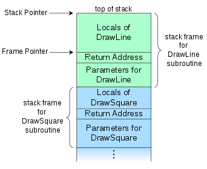

我想打印 ebx 的值,然后发现没有打印整数的函数,我是不是要重新整个标准库??????

1.20 遇到问题,如下代码:
```c
unsigned long t = 0x1 << 32;
```
这里直接打印 0,
除非写成:
```c
unsigned long t = 0x1;
t <<=  32;
// 或者
unsigned long t = ((unsigned long)0x1)<<32;
```

gcc 是吧常数当成 32 位了吗?

这里有类似的问题
https://stackoverflow.com/questions/16515534/why-does-left-shift-with-variables-generate-different-result-from-that-with-cons

遇到一个坑, -lgcc 参数需要添加在最后(依赖他的文件的后面),
cmake 解决方法:
target_link_libraries(${KERNEL_BIN} PUBLIC gcc)


gcc WRNM

定义的 gdt 结构体没有加:
__attribute__((packed))

导致 结构体内的值没有紧挨在一起.....


提供一份内嵌汇编设置 gdt, 内嵌汇编不方便调试:
```s
asm volatile (
"lgdt (%0) \n\t"
"movw %1,%%es \n\t"
"movw %1,%%ds \n\t"
"movw %1,%%fs \n\t"
"movw %1,%%gs \n\t"
"movw %1,%%ss \n\t"
"jmp $0x08,$foo \n\t"  // 设置 cs 寄存器并清空流水线
"foo: "
::"r"((uint32_t) &gdtr), "r"((uint16_t)0x10)
);
```


函数调用栈:

https://en.wikipedia.org/wiki/Call_stack#STACK-FRAME

值得注意的是: cpu栈指针(stack pointer)与函数栈帧(Frame Pointer)指向不同的地方!

x86 中 frame pointer 是 ebp 寄存器(没有求证),但 c 调用汇编并不是这样...也就是 汇编代码并没有 绿色的 Local of Drawline 这段未分配区域,这段区域叫做 red zone,这些计数叫做 *frame pointer optimization*

c 函数调用,参数从右至左压栈,最后为返回地址


`__attribute__((interrupt))`:

https://gcc.gnu.org/onlinedocs/gcc/x86-Function-Attributes.html#x86-Function-Attributes

red zone:

https://en.wikipedia.org/wiki/Red_zone_(computing)


gcc 参数:

-mgeneral-regs-only: 

Generate code that uses only the general-purpose registers.This prevents the compiler from using floating-point, vector, mask and bound registers.


-mno-red-zone:

Do not use a so-called “red zone” for x86-64 code. The red zone is mandated by the x86-64 ABI; it is a 128-byte area beyond the location of the stack pointer that is not modified by signal or interrupt handlers and therefore can be used for temporary data without adjusting the stack pointer. The flag -mno-red-zone disables this red zone.